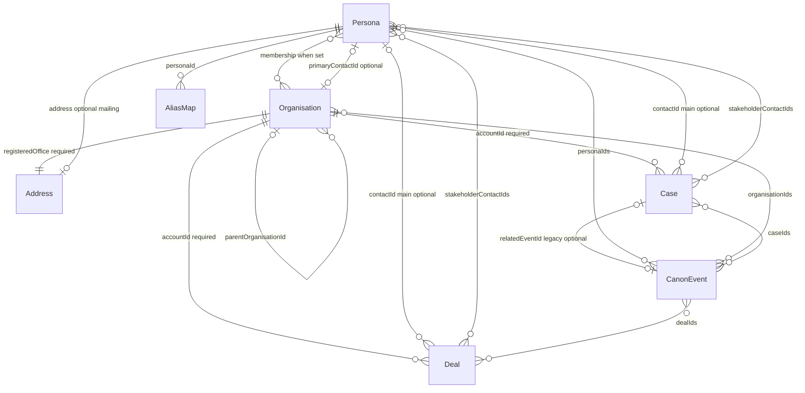
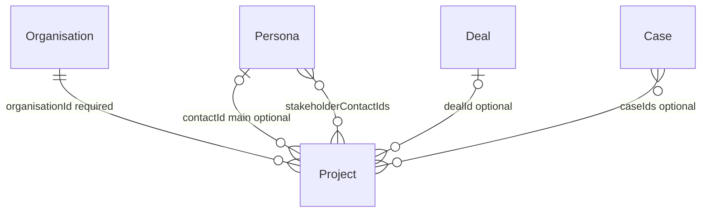
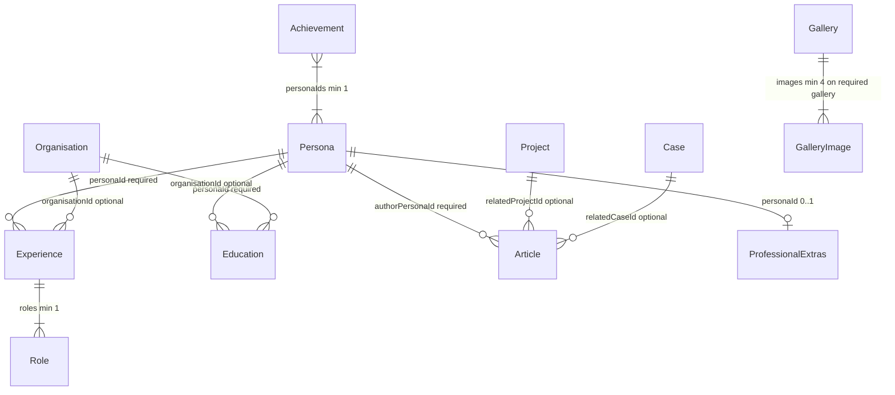
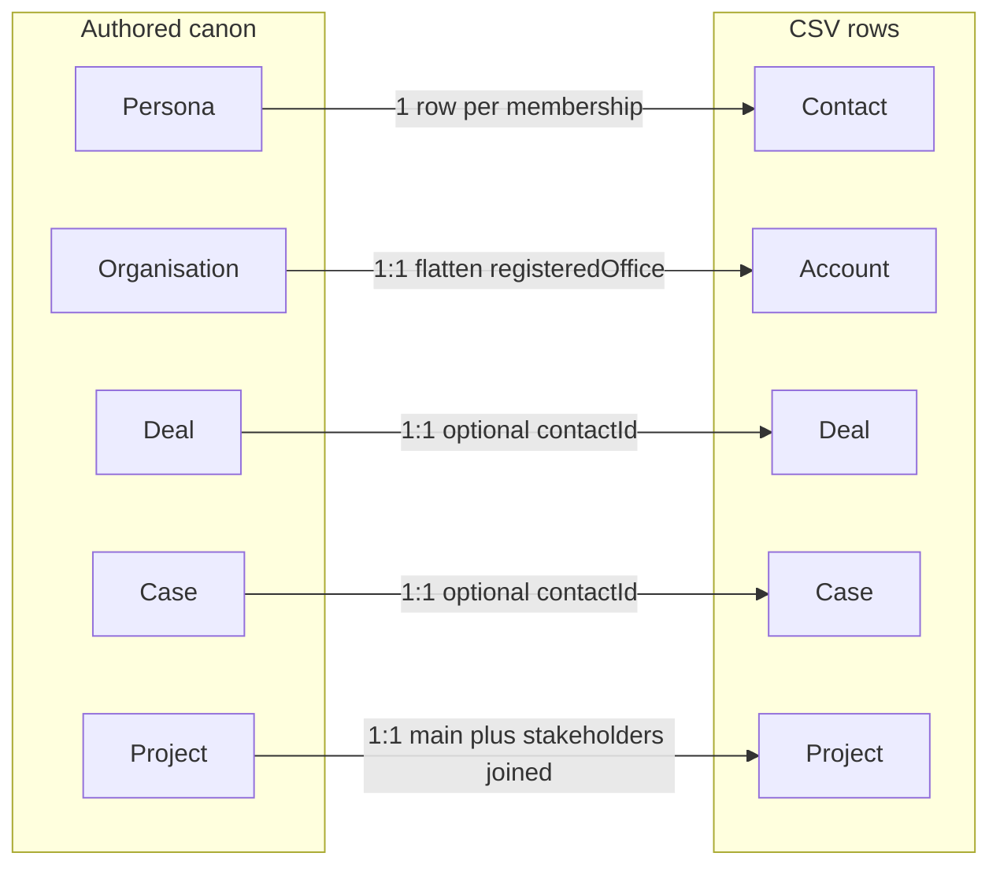

# Entity relationships

**CRM-shaped join graph** for Turpinverse canon and export. Shipped JSON, JSON Schema, `CanonValidator`, CSV export, Hugo publication, and Blazor previews follow this model for real-world CRM import fidelity while keeping Turpinverse as the source of truth for names and stories.

> **Shipped in:** [spec `008-crm-join-graph`](../specs/008-crm-join-graph/spec.md) (GitHub [#41](https://github.com/markheydon/turpinverse/issues/41)).

This is a repo artefact (human- and machine-readable Mermaid). Field-level validation codes **VR-052–VR-059** are enforced in `CanonValidator` and export tests (see [completeness contract](../specs/008-crm-join-graph/contracts/completeness.md)).

Source of truth for **fields** remains feature data models under `specs/` and `src/Turpinverse.Core/Models/`. This page is the **join graph**.

## Naming

Canon JSON uses universe names. CSV export uses CRM names. They are the same logical records.

| Canon | CRM export | Notes |
|-------|------------|--------|
| Persona | Contact | One persona; export emits one CSV row **per account membership** (see Export) |
| Organisation | Account | 1:1 via `organisation.id` → `accountId` |
| Deal | Deal (opportunity analogue) | Authored in `deals.json`; not derived |
| Case | Case | Authored in `cases.json`; not derived |
| Project | Project (optional export) | Shared catalog, not a CRM standard object |

`ProfessionalExtras.contact` is presentation copy on a person page. It is **not** a CRM Contact.

## Core graph (membership, pipeline, timeline)



### What that means

| Link | Target cardinality | Keys | Constraints |
|------|-------------------|------|-------------|
| Persona → Organisation | Many-to-many; contact **must** have ≥1 account | `organisationIds` / `memberPersonaIds` | B2B: no unassigned contacts. Bidirectional when a link exists (VR-003 today). |
| Organisation → Persona | Zero-or-more members | `memberPersonaIds` | Account **may** have zero contacts (prospect / placeholder). |
| Organisation primary contact | Zero-or-one | `primaryContactId` | If set, must be a member. Distinct from contact’s primary account (`organisationIds[0]`). |
| Organisation parent | Zero-or-one parent; zero-or-more children | `parentOrganisationId` | Must reference an existing org when set; no cycles. |
| Deal → Organisation | Exactly one account | `accountId` | Required. |
| Deal → Persona (main) | Zero-or-one | `contactId` | Optional for early pipeline. **When set, must be a member of the deal’s account.** Deceased personas must not own **active** deals (VR-007 today). |
| Deal stakeholders | Zero-or-more | `stakeholderContactIds` | Need **not** be members of the deal’s account (e.g. third-party vendor). |
| Case → Organisation | Exactly one account | `accountId` | Required. |
| Case → Persona (main) | Zero-or-one | `contactId` | Same rules as deal main contact. |
| Case stakeholders | Zero-or-more | `stakeholderContactIds` | Need not be account members. |
| Case → CanonEvent | Zero-or-one (legacy) | `relatedEventId` | Optional; prefer event→case association on the event where both exist. |
| CanonEvent ↔ Persona / Organisation / Deal / Case | Zero-or-more each way | `personaIds`, `organisationIds`, `dealIds`, `caseIds` | Optional arrays; slugs must exist when set. |
| CanonEvent roll-up | Presentation only | — | Linking an event to a case **implies** that case’s account and main contact on Hugo/export timelines; do **not** duplicate those IDs in `events.json`. |
| AliasMap → Persona | Many aliases, one persona | `personaId` | Alias strings globally unique. |
| Address | Nested value object | Org: `registeredOffice`; Persona: `address` | Not shared by id. Per-account email/phone/address **not** in canon — see Export. |

## Commercial objects and projects



### What that means

| Link | Target cardinality | Keys | Constraints |
|------|-------------------|------|-------------|
| Project → Organisation | Exactly one | `organisationId` | Sponsoring account. |
| Project → Persona (main) | Zero-or-one | `contactId` | When set, must be a member of the sponsoring account. |
| Project stakeholders | Zero-or-more | `stakeholderContactIds` | Need not be account members. |
| Project → Deal | Zero-or-one | `dealId` | Project as outcome of won work. |
| Project → Case | Zero-or-more | `caseIds` | Cases as delivery vehicles for project work. |
| Project people (union) | For Hugo/Blazor filters | main ∪ stakeholders | “Projects this person is on” uses all linked contact ids. |

Article `relatedProjectId` / `relatedCaseId` remain **publication** links (“this article is about X”), independent of project→deal/case lineage.

## Career, portfolio, and publication



### What that means

| Link | Target cardinality | Notes |
|------|-------------------|-------|
| Experience → Persona | Exactly one | One grouping per persona per employer key (VR-025 today). |
| Experience → Organisation | Zero-or-one | `organisationId` optional; does not require bidirectional membership. |
| Education → Persona | Exactly one | Owned by one person. |
| Education → Organisation | Zero-or-one | Same optional-org pattern as experience. |
| Achievement ↔ Persona | Many-to-many, min one persona | No organisation FK. |
| Article → Persona | Exactly one author | Author must exist; published mix rules require Turpin Enterprises membership (VR-029 today). |
| Article → Project / Case | Zero-or-one each | Named related links only; reverse lists not required. |
| ProfessionalExtras → Persona | At most one extras row per person | Not CRM Contact. |
| Gallery | Standalone | `subject` is `team` \| `workplace` \| `brand`. No persona or organisation FK. |

Career and publication collections do **not** add CSV columns on contacts, accounts, deals, or cases. See [career-portfolio-mapping.md](./career-portfolio-mapping.md) and [article-gallery-mapping.md](./article-gallery-mapping.md).

## Export projection (shipped)



| Projection | Shipped behaviour |
|------------|-------------------|
| Contact | **One CSV row per** `(persona, organisation)` membership (**VR-059**). Same `contactId` (persona slug) on each row; `accountId` differs. Email/phone/address copied from persona (canon has one identity per person). Collision policy documented on the Blazor contacts export page and in [export-api.md](../specs/001-turpinverse-universe/contracts/export-api.md). |
| Account | 1:1 from Organisation; optional `primaryContactId` column when set on the organisation. |
| Deal / Case | 1:1; optional `contactId`; `stakeholderContactIds` as a semicolon-separated column (empty when none). |
| Project | 1:1; optional `contactId`, `dealId`, `caseIds`; `stakeholderContactIds` column. Project people in export are main ∪ stakeholders. |

Deals and cases are authored in canon; they are not generated from membership edges at export time.

## Intentionally not in canon

| Topic | Decision |
|-------|----------|
| Unassigned contacts | Not allowed — every persona keeps ≥1 `organisationIds` entry (B2B). |
| Per-account contact identity | Not in canon. Duplicate contact rows at export only. |
| Shared Address records | Not modelled; billing vs shipping; geocodes. |
| Gallery / professional-extras → org | Not modelled. |
| Leads, activities, products, quotes | Future CRM/commercial stories (#32 epic); not part of this join graph. |

## Join-graph validation codes (shipped)

| Code | Scope | Rule |
|------|-------|------|
| VR-052 | Organisation | `primaryContactId` omitted **or** is a member |
| VR-053 | Deal, Case, Project | Exactly one existing account |
| VR-054 | Deal, Case, Project | `contactId` omitted **or** exists and is an account member |
| VR-055 | Deal, Case, Project | Stakeholders exist, unique, not equal to main |
| VR-056 | Project | `dealId` / `caseIds` omitted or exist |
| VR-057 | CanonEvent | `dealIds` / `caseIds` omitted or exist |
| VR-058 | Named records | `deal-008`, `case-001`, `case-017`, `palmer-identity-vault` match the repaired deputies below |
| VR-059 | Contact export | Row count equals membership links (export tests, not `/validate` body) |

## Repaired canon rows (shipped)

Four story rows were corrected so main contacts are account members and former non-member names moved to stakeholders (no new people, empty accounts, or contact-less pipeline rows):

| Record | Account | Main contact | Stakeholder |
|--------|---------|--------------|-------------|
| `deal-008` | Epping Forest Authority | William Hargreaves | Henry Clayton |
| `case-001` | Brazier Legal | Mary Brazier | Richard Turpin (`dick-turpin`) |
| `case-017` | Turpin Enterprises | Henry Clayton | Thomas Collier |
| `palmer-identity-vault` | Brazier Legal | Mary Brazier | Richard Turpin (`dick-turpin`) |

## Where to edit data

```text
src/Turpinverse.Data/canon/
├── personas.json
├── organisations.json
├── events.json
├── aliases.json
├── deals.json
├── cases.json
├── experience.json
├── education.json
├── projects.json
├── achievements.json
├── articles.json
├── galleries.json
└── professional-extras.json
```
