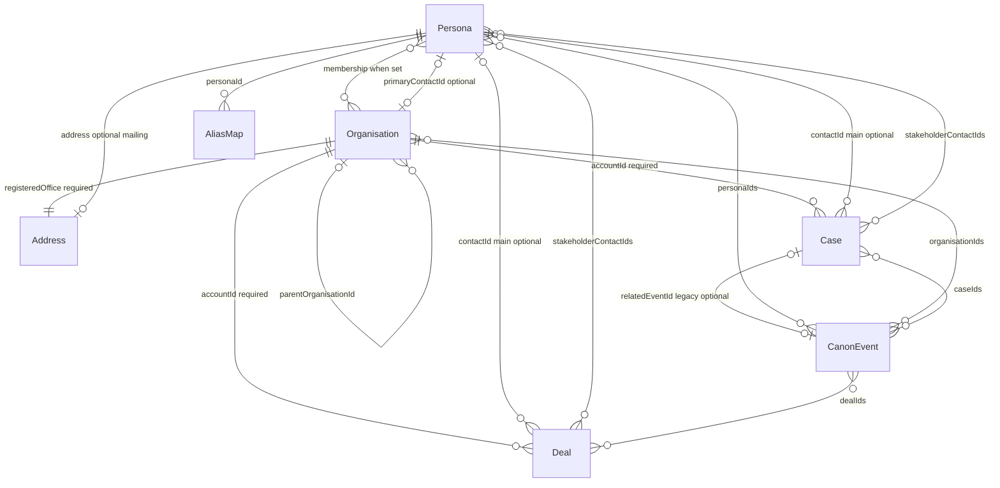
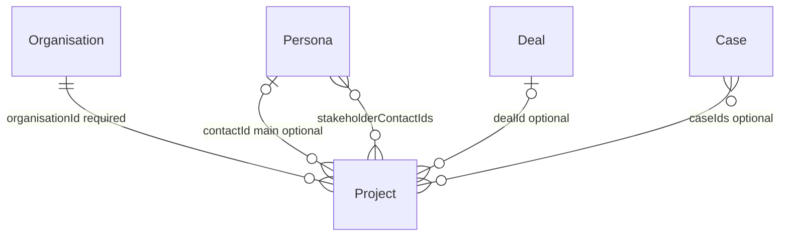
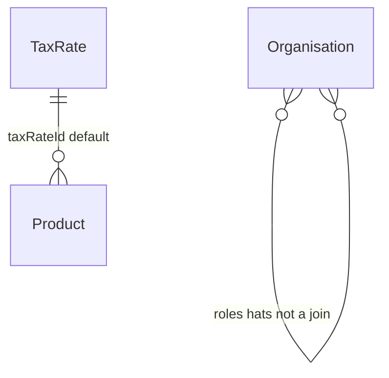
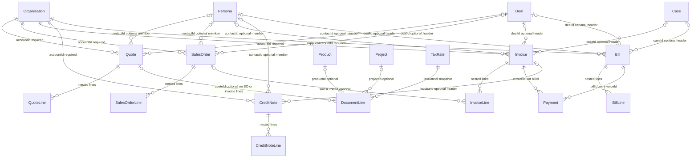
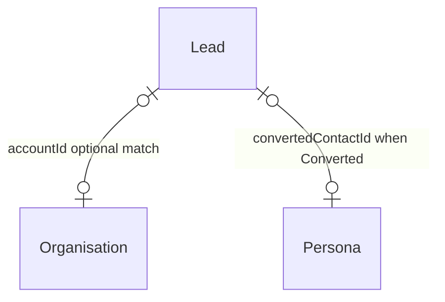
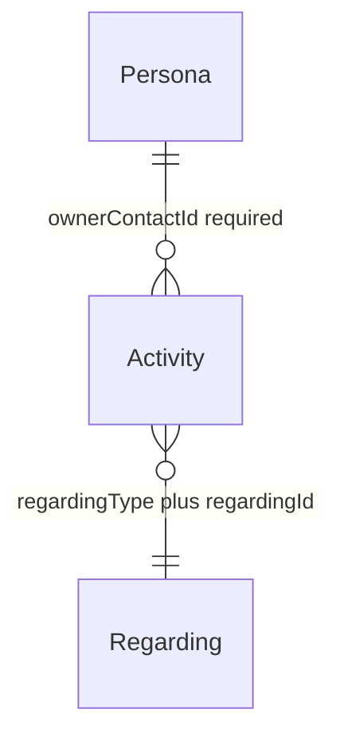
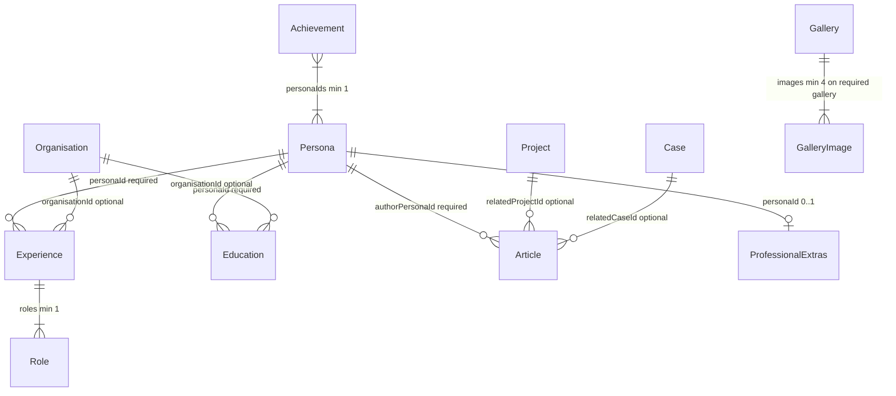
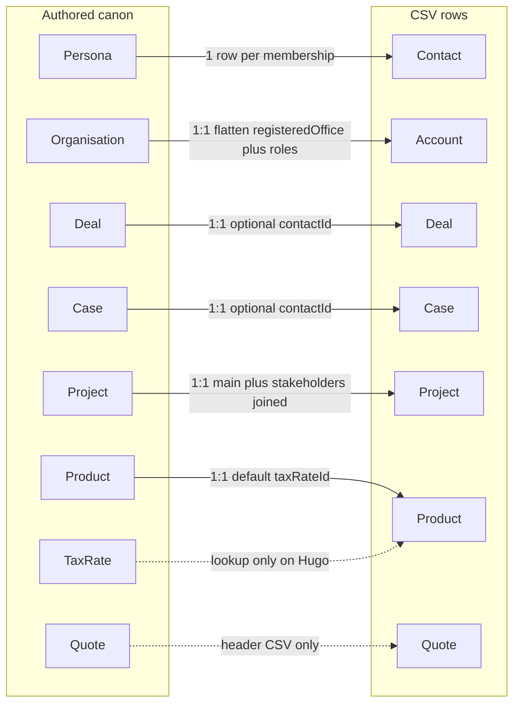

# Entity relationships

**CRM-shaped join graph** for Turpinverse canon and export. Shipped JSON, JSON Schema, `CanonValidator`, CSV export, Hugo publication, and Blazor previews follow this model for real-world CRM import fidelity while keeping Turpinverse as the source of truth for names and stories.

Field-level validation codes **VR-052–VR-059** are enforced in `CanonValidator` and export tests (see [validation-rules.md](./validation-rules.md)).

Source of truth for **fields**: `canon/*.json`, [`canon/schema/canon-schema.json`](../canon/schema/canon-schema.json), and `src/Turpinverse.Core/Models/`. This page is the **join graph**.

## Naming

Canon JSON uses universe names. CSV export uses CRM names. They are the same logical records.

| Canon | CRM export | Notes |
|-------|------------|--------|
| Persona | Contact | One persona; export emits one CSV row **per account membership** (see Export) |
| Organisation | Account | 1:1 via `organisation.id` → `accountId` |
| Deal | Deal (opportunity analogue) | Authored in `deals.json`; not derived |
| Case | Case | Authored in `cases.json`; not derived |
| Project | Project (optional export) | Delivery/portfolio work; not the price book |
| Product | Product / service | Catalogue item in `products.json`; distinct from Project |
| TaxRate | Tax rate | UK VAT lookup in `tax-rates.json` |
| Quote | Quote / estimate | Authored in `quotes.json` |
| SalesOrder | Sales order | Authored in `sales-orders.json` |
| Invoice | Sales invoice (ACCREC) | Authored in `invoices.json` |
| Payment | Payment | Settles one invoice **or** one bill |
| CreditNote | Credit note (AR) | Authored in `credit-notes.json` |
| Bill | Bill / purchase invoice (ACCPAY) | Authored in `bills.json` |
| Lead | Lead | Pre-contact prospect in `leads.json` |
| Activity | Activity | CRM interaction in `activities.json` |

`ProfessionalExtras.contact` is presentation copy on a person page. It is **not** a CRM Contact.

## Core graph (membership, pipeline, timeline)



### What that means

| Link | Target cardinality | Keys | Constraints |
|------|-------------------|------|-------------|
| Persona → Organisation | Many-to-many; contact **must** have ≥1 account | `organisationIds` / `memberPersonaIds` | B2B: no unassigned contacts. Bidirectional when a link exists (VR-003 today). |
| Organisation → Persona | Zero-or-more members | `memberPersonaIds` | Account **may** have zero contacts (prospect / placeholder). |
| Organisation primary contact | Zero-or-one | `primaryContactId` | If set, must be a member. Distinct from contact’s primary account (`organisationIds[0]`). |
| Organisation parent | Zero-or-one parent; zero-or-more children | `parentOrganisationId` | Must reference an existing org when set; no cycles. |
| Deal → Organisation | Exactly one account | `accountId` | Required. |
| Deal → Persona (main) | Zero-or-one | `contactId` | Optional for early pipeline. **When set, must be a member of the deal’s account.** Deceased personas must not own **active** deals (VR-007 today). |
| Deal stakeholders | Zero-or-more | `stakeholderContactIds` | Need **not** be members of the deal’s account (e.g. third-party vendor). |
| Case → Organisation | Exactly one account | `accountId` | Required. |
| Case → Persona (main) | Zero-or-one | `contactId` | Same rules as deal main contact. |
| Case stakeholders | Zero-or-more | `stakeholderContactIds` | Need not be account members. |
| Case → CanonEvent | Zero-or-one (legacy) | `relatedEventId` | Optional; prefer event→case association on the event where both exist. |
| CanonEvent ↔ Persona / Organisation / Deal / Case | Zero-or-more each way | `personaIds`, `organisationIds`, `dealIds`, `caseIds` | Optional arrays; slugs must exist when set. |
| CanonEvent roll-up | Presentation only | — | Linking an event to a case **implies** that case’s account and main contact on Hugo/export timelines; do **not** duplicate those IDs in `events.json`. |
| AliasMap → Persona | Many aliases, one persona | `personaId` | Alias strings globally unique. |
| Address | Nested value object | Org: `registeredOffice`; Persona: `address` | Not shared by id. Per-account email/phone/address **not** in canon — see Export. |

## Commercial objects and projects



### What that means

| Link | Target cardinality | Keys | Constraints |
|------|-------------------|------|-------------|
| Project → Organisation | Exactly one | `organisationId` | Sponsoring account. |
| Project → Persona (main) | Zero-or-one | `contactId` | When set, must be a member of the sponsoring account. |
| Project stakeholders | Zero-or-more | `stakeholderContactIds` | Need not be account members. |
| Project → Deal | Zero-or-one | `dealId` | Project as outcome of won work. |
| Project → Case | Zero-or-more | `caseIds` | Cases as delivery vehicles for project work. |
| Project people (union) | For Hugo/Blazor filters | main ∪ stakeholders | “Projects this person is on” uses all linked contact ids. |

Article `relatedProjectId` / `relatedCaseId` remain **publication** links (“this article is about X”), independent of project→deal/case lineage.

## Catalogue and account roles



### What that means

| Link | Target cardinality | Keys | Constraints |
|------|-------------------|------|-------------|
| Product → TaxRate | Exactly one default | `taxRateId` | Reference table only — not a tax engine. |
| Product ↔ Project | **Not linked** | — | `projects.json` is delivery/portfolio; `products.json` is the price book. |
| Organisation commercial hats | Zero-or-more | `roles[]` | Values: `customer`, `supplier`, `partner`. Unique; min 0. Authored — not inferred from documents. |
| Books owner | Convention | — | Turpin Enterprises (`turpin-enterprises`) is the implicit home books. AR documents are *from* that entity; bills are AP *to* suppliers. No `sellerAccountId` on documents; no `internal` role. |
| AR document → Organisation | Exactly one customer | `accountId` on quote, sales order, invoice, credit note | Org **must** include `customer` in `roles` when the document exists. |
| Bill → Organisation | Exactly one supplier | `supplierAccountId` | Org **must** include `supplier` in `roles`. |
| `partner` hat | With customer or supplier | — | Allowed alongside either; does not by itself authorise AR or AP. |

Discontinued products may still appear on issued document lines. Line items **snapshot** `taxRateId` and `unitPrice` so historical documents do not move when the catalogue changes.

## Commercial documents

Sales-side documents share a **header** (the piece of paper and its counterparty) and **nested lines** (allocation). Bills are AP — separate type, not a sales-invoice status.



### Document headers

| Field | Quote / sales order / invoice / credit note | Bill |
|-------|---------------------------------------------|------|
| Counterparty | `accountId` **required** | `supplierAccountId` **required** |
| Main contact | `contactId` optional; membership against counterparty (VR-054 pattern) | `contactId` optional; membership against **supplier** account |
| CRM opportunity | `dealId` optional; at most one; omit if paper spans deals | `dealId` optional |
| Dispute / service case | `caseId` optional on invoice | `caseId` optional (e.g. `case-011` AP dispute on a bill) |
| Currency | `currency` required; `GBP` only in v1 | Same |
| Totals | `subtotal`, `taxTotal`, `total` authored | Same |

**Not on invoice or bill headers:** `projectId`, `salesOrderId`, `quoteId`. One invoice can cover several orders or several projects via lines.

**No required chain.** Quote → sales order → invoice is narrative, not schema. An invoice without quote or order is valid.

### Shared line shape (nested in parent JSON)

Description and money fields are required; every FK on the line is optional. No separate `quote-lines.json` — CSV flattening is export-only.

| Line field | Quote | Sales order | Invoice | Bill | Credit note |
|------------|-------|-------------|---------|------|-------------|
| `description`, `quantity`, `unitPrice`, `taxRateId`, `lineTotal` | required | required | required | required | required |
| `productId` | optional | optional | optional | optional | optional |
| `projectId` | optional | optional | optional | optional | optional |
| `quoteId` | — | optional | optional | — | — |
| `salesOrderId` | — | — | optional | — | — |

A whole-project quote or sales order may be a single lump line: `projectId` set, `productId` omitted, description names the work.

**Rejected:** requiring `productId` on lines; `quoteLineId` / `salesOrderLineId` (line-to-line matching); header-level `projectId` / `salesOrderId` / `quoteId` on invoices and bills.

### Line allocation constraints

| When set on line | Rule |
|------------------|------|
| Invoice line `projectId` | `project.organisationId` must equal `invoice.accountId`. |
| Invoice line `salesOrderId` or `quoteId` | Referenced document’s `accountId` must equal invoice’s `accountId`. |
| Sales-order line `quoteId` | Quote’s `accountId` must equal order’s `accountId`. |
| Quote / sales-order line `projectId` | `project.organisationId` must equal that document’s `accountId`. |
| Bill line `projectId` | Project must exist. **Do not** require `project.organisationId` = supplier — a supplier bill can cost a Turpin-side delivery project (e.g. equine hire from `king-equine-trading`). |

Consumers that need “invoices for this project” join through lines, not a header field.

### Payments and credit notes

| Link | Cardinality | Keys | Constraints |
|------|-------------|------|-------------|
| Payment → Invoice **or** Bill | Exactly one target | `invoiceId` **XOR** `billId` | Sum of payments on a document ≤ document `total`. Credits handled separately. |
| Credit note → Invoice | Zero-or-one | `invoiceId` optional header | AR only in v1. When set, same `accountId`. Nested lines. No supplier-credit type (parked). |

### case-011 (AP dispute)

`case-011` (“Accounts payable — Q3 invoice dispute”, account `brazier-legal`, deal `deal-017`) links to a **Bill** via header `caseId`, not to a sales invoice. Margaret Hayes owns the case as main contact; she is not a second people FK on the bill. #35 may still ship a separate customer invoice-dispute example; it must not misuse `case-011`.

## Leads



### What that means

| Link | Target cardinality | Keys | Constraints |
|------|-------------------|------|-------------|
| Lead → Organisation | Zero-or-one | `accountId` | Optional match to known org; no membership required. |
| Lead → Persona | Zero-or-one | `convertedContactId` | **Required** when `status` is `Converted`; must be existing persona. No new personas for conversion. |
| Lead identity | Pre-contact | `companyName`, `contactName`, `email`, `phone` | Strings — not persona/org FKs until converted. |
| Lead → commercial docs | **Not linked** | — | No quotes/invoices until converted; then use persona like any contact. |
| Conversion side effects | None | — | No automatic membership write on conversion. |

## Activities



Activities are CRM interaction history (calls, emails, meetings, tasks, notes). **CanonEvent** (universe timeline) stays separate — no FK between Activity and CanonEvent.

### What that means

| Link | Target cardinality | Keys | Constraints |
|------|-------------------|------|-------------|
| Activity → Persona (owner) | Exactly one | `ownerContactId` | Sales/service rep who owns the activity. |
| Activity → regarding record | Exactly one | `regardingType`, `regardingId` | Closed enum: `contact`, `deal`, `case`, `lead`, `invoice`, `bill`, `quote`, `salesOrder`. |
| Regarding project / org / payment / credit note / product | **Not modelled** | — | Reach via document or contact. Adding a `regardingType` later is additive. |

Curated volume only (~20–25 activities total) — not a full history per record.

## Import mapping (Xero / FreeAgent / QuickBooks / Sage)

Turpinverse is a **generic CRM + SME commercial file**, not a clone of any one API. Importers flatten; mapping should be mechanical.

| Turpinverse | Xero | FreeAgent | QuickBooks Online | Sage Accounting |
|-------------|------|-----------|-------------------|-----------------|
| Organisation | Contact | Contact | Customer (AR) / Vendor (AP) | Contact |
| Persona | Contact person | — (on contact) | — | — |
| `roles[]` | `IsCustomer` / `IsSupplier` (derived) | — | Separate Customer/Vendor lists | — |
| Invoice `accountId` | `Contact` on ACCREC | `contact` | `CustomerRef` | `contact_id` |
| Bill `supplierAccountId` | `Contact` on ACCPAY | — (supplier contact) | `VendorRef` | `contact_id` |
| Line `productId` | `ItemCode` / optional | Stock item optional | `ItemRef` (often required — use dummy “Services” item) | Product optional |
| Line `taxRateId` | `TaxType` | Sales tax | `TaxCodeRef` | `tax_rate_id` |
| Line `projectId` | Tracking category | `project` on invoice item | `ClassRef` per line (not Job) | — (Sage 50: project per line) |
| Line `salesOrderId` | — (no SO object) | — | — | — |
| Payment | Payment → invoice or bill | — | Payment | Payment |
| Credit note | Credit note + allocation | — | Credit memo | Credit note |
| Nominal / ledger code | `AccountCode` on line | Category | Account on item | `ledger_account_id` | **Parked** — importer applies default account |

**Importer notes:** Map organisation → their Contact. If every invoice line shares one `projectId`, FreeAgent importers may copy it to the FA invoice header; otherwise leave header project empty. QBO Jobs are sub-customers (one per invoice) — multi-project invoices use Classes or split invoices. Sales-order FKs are dropped on Xero/FreeAgent/QBO/Sage Business Cloud import.

## Career, portfolio, and publication



### What that means

| Link | Target cardinality | Notes |
|------|-------------------|-------|
| Experience → Persona | Exactly one | One grouping per persona per employer key (VR-025 today). |
| Experience → Organisation | Zero-or-one | `organisationId` optional; does not require bidirectional membership. |
| Education → Persona | Exactly one | Owned by one person. |
| Education → Organisation | Zero-or-one | Same optional-org pattern as experience. |
| Achievement ↔ Persona | Many-to-many, min one persona | No organisation FK. |
| Article → Persona | Exactly one author | Author must exist; published mix rules require Turpin Enterprises membership (VR-029 today). |
| Article → Project / Case | Zero-or-one each | Named related links only; reverse lists not required. |
| ProfessionalExtras → Persona | At most one extras row per person | Not CRM Contact. |
| Gallery | Standalone | `subject` is `team` \| `workplace` \| `brand`. No persona or organisation FK. |

Career and publication collections do **not** add CSV columns on contacts, accounts, deals, or cases. See [career-portfolio-mapping.md](./career-portfolio-mapping.md) and [article-gallery-mapping.md](./article-gallery-mapping.md).

## Export projection (shipped)



| Projection | Shipped behaviour |
|------------|-------------------|
| Contact | **One CSV row per** `(persona, organisation)` membership (**VR-059**). Same `contactId` (persona slug) on each row; `accountId` differs. Email/phone/address copied from persona (canon has one identity per person). Collision policy documented on the Blazor contacts export page and in [export-api.md](./export-api.md). |
| Account | 1:1 from Organisation; optional `primaryContactId` column when set; `roles` as semicolon-separated `customer` / `supplier` / `partner` (empty when none). |
| Product | 1:1 from catalogue item; `taxRateId` is the default VAT lookup (lines snapshot later). |
| Deal / Case | 1:1; optional `contactId`; `stakeholderContactIds` as a semicolon-separated column (empty when none). |
| Project | 1:1; optional `contactId`, `dealId`, `caseIds`; `stakeholderContactIds` column. Project people in export are main ∪ stakeholders. |
| Quote | 1:1 **header only**; nested `lines[]` omitted from CSV (Hugo detail and canon JSON). Optional `contactId`, `dealId`. |

Deals and cases are authored in canon; they are not generated from membership edges at export time.

## Intentionally not in canon

| Topic | Decision |
|-------|----------|
| Unassigned contacts | Not allowed — every persona keeps ≥1 `organisationIds` entry (B2B). |
| Per-account contact identity | Not in canon. Duplicate contact rows at export only. |
| Shared Address records | Not modelled; billing vs shipping; geocodes. |
| Gallery / professional-extras → org | Not modelled. |
| Chart of accounts / nominal codes on lines | Parked (#32). Importers apply default sales/purchase accounts. |
| Journals, bank accounts, reconciliation | Parked (#32). |
| Payroll, inventory, purchase orders (separate from bills) | Parked (#32). |
| Recurring invoices, multi-currency, timesheets, fixed assets | Parked (#32). |
| Campaigns, territories, queues, SLAs | Parked (#32). |
| Document attachments / PDFs | Parked (#32). |
| Supplier credit notes (AP credits) | Parked — AR credit notes only in #35. |
| Multi-invoice credit-note allocation | Parked — optional 1:1 `invoiceId` on credit note is enough for demo. |
| Activity ↔ CanonEvent | Separate models; no FK. |
| Line-to-line document matching (`quoteLineId`, `salesOrderLineId`) | Not modelled. |

## Join-graph validation codes (shipped)

| Code | Scope | Rule |
|------|-------|------|
| VR-052 | Organisation | `primaryContactId` omitted **or** is a member |
| VR-053 | Deal, Case, Project | Exactly one existing account |
| VR-054 | Deal, Case, Project | `contactId` omitted **or** exists and is an account member |
| VR-055 | Deal, Case, Project | Stakeholders exist, unique, not equal to main |
| VR-056 | Project | `dealId` / `caseIds` omitted or exist |
| VR-057 | CanonEvent | `dealIds` / `caseIds` omitted or exist |
| VR-058 | Named records | `deal-008`, `case-001`, `case-017`, `palmer-identity-vault` match the repaired deputies below |
| VR-059 | Contact export | Row count equals membership links (export tests, not `/validate` body) |
| VR-060 | TaxRate | Exactly four UK VAT rows with required ids and percentages |
| VR-061 | Product | Unique ids; required fields; ≥10 catalogue items |
| VR-062 | Product | `taxRateId` references an existing tax rate |
| VR-063 | Organisation | `roles[]` enum, unique, min 0; `turpin-enterprises` has none |
| VR-064 | Organisation | Named supplier/partner hats on key story orgs |
| VR-068 | Quote | Unique ids/numbers; ≥8 quotes; `QUO-YYYY-nnnn` |
| VR-069 | Quote | `accountId` customer role |
| VR-070 | Quote | `contactId` membership against account |
| VR-071 | Quote | `dealId` account alignment; ≥2 quotes share one `dealId` |
| VR-072 | Quote line | FK and project sponsoring-org rules |
| VR-073 | Quote | Authored money (per-line VAT rounded to 2 dp) and date order |
| VR-074 | Quote | Status/currency enums; 2–5 lines |

## Repaired canon rows (shipped)

Four story rows were corrected so main contacts are account members and former non-member names moved to stakeholders (no new people, empty accounts, or contact-less pipeline rows):

| Record | Account | Main contact | Stakeholder |
|--------|---------|--------------|-------------|
| `deal-008` | Epping Forest Authority | William Hargreaves | Henry Clayton |
| `case-001` | Brazier Legal | Mary Brazier | Richard Turpin (`dick-turpin`) |
| `case-017` | Turpin Enterprises | Henry Clayton | Thomas Collier |
| `palmer-identity-vault` | Brazier Legal | Mary Brazier | Richard Turpin (`dick-turpin`) |

## Where to edit data

```text
canon/
├── personas.json
├── organisations.json          # roles[] (customer / supplier / partner)
├── events.json
├── aliases.json
├── deals.json
├── cases.json
├── experience.json
├── education.json
├── projects.json
├── achievements.json
├── articles.json
├── galleries.json
├── professional-extras.json
│
├── products.json
├── tax-rates.json
├── leads.json
│
├── quotes.json                 # shipped #34
│  # Agreed graph — remaining files land with child stories (#35–#36, #38):
├── sales-orders.json           # #36
├── invoices.json               # #35
├── payments.json               # #35
├── credit-notes.json           # #35
├── bills.json                  # #36
└── activities.json             # #38
```

See [canon/README.md](../canon/README.md) for how to consume these files from another project.
