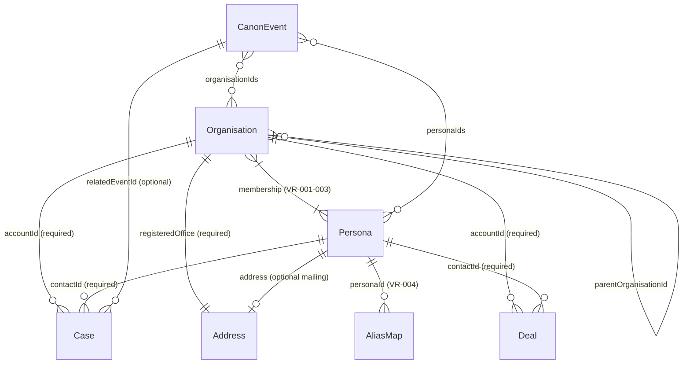
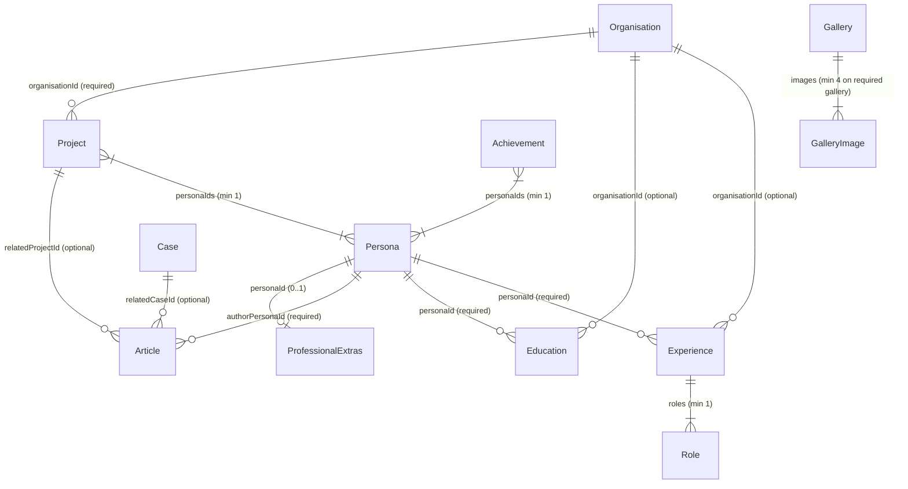
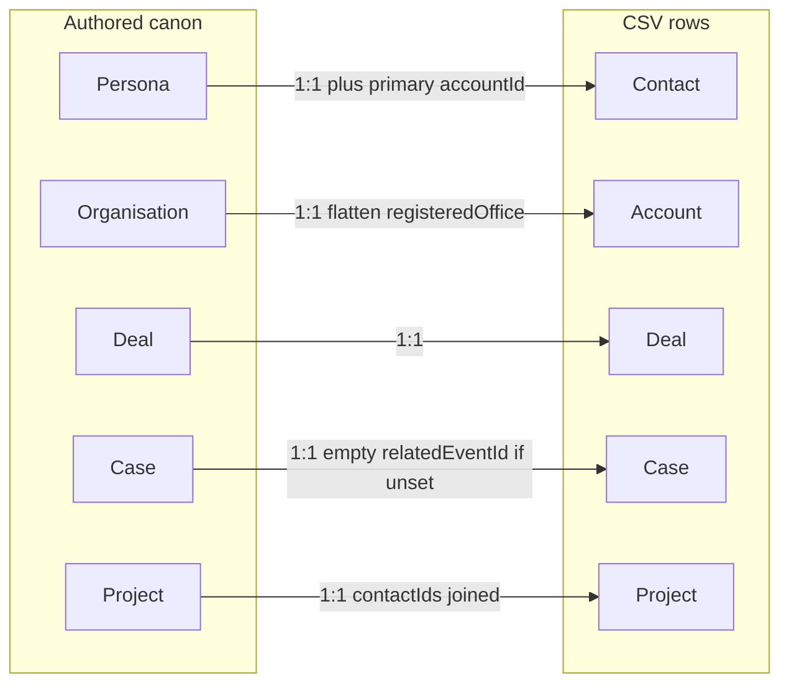

# Entity relationships

How Turpinverse entities link **today**, before we add more complicated dataset relationships.

This is a repo artefact (human- and machine-readable Mermaid). It does not change the Blazor app or Hugo site. Cardinalities match the live canon schema and `CanonValidator` rules, not a generic CRM wishlist.

Source of truth for fields and validation codes remains the feature data models under `specs/` and `src/Turpinverse.Core/Models/`. This page is the **join graph**.

## Naming

Canon JSON uses universe names. CSV export uses CRM names. They are the same records.

| Canon | CRM export | Notes |
|-------|------------|--------|
| Persona | Contact | 1:1 via `persona.id` → `contactId` |
| Organisation | Account | 1:1 via `organisation.id` → `accountId` |
| Deal | Deal (opportunity analogue) | Authored in `deals.json`; not derived |
| Case | Case | Authored in `cases.json`; not derived |
| Project | Project (optional export) | Shared catalog, not a CRM standard object |

`ProfessionalExtras.contact` is presentation copy on a person page. It is **not** a CRM Contact.

## Core graph (membership, pipeline, timeline)



### What that means

| Link | Cardinality now | Keys | Constraints |
|------|-----------------|------|-------------|
| Organisation ↔ Persona | Many-to-many, **at least one on each side** | `memberPersonaIds` / `organisationIds` | Both slugs must exist. If a persona lists an org, that org must list the persona (VR-003). Schema `minItems: 1` on both arrays — empty membership is **not** allowed yet. |
| Organisation parent | Zero-or-one parent; zero-or-more children | `parentOrganisationId` | Must be an existing org when set. Used today (e.g. a child of `essex-gang`). |
| Deal → Organisation | Exactly one account | `accountId` | Required. Unknown account fails VR-005. |
| Deal → Persona | Exactly one contact | `contactId` | Required. Unknown contact fails VR-005. Deceased personas must not own **active** deals (VR-007). The contact **need not** be a member of the deal’s account. |
| Case → Organisation | Exactly one account | `accountId` | Required (VR-006). |
| Case → Persona | Exactly one contact | `contactId` | Required (VR-006). Same as deals: membership of that account is not enforced. |
| Case → CanonEvent | Zero-or-one | `relatedEventId` | Optional; must exist when set (VR-012). |
| CanonEvent ↔ Persona / Organisation | Zero-or-more each way | `personaIds`, `organisationIds` | Optional arrays; slugs must exist (VR-011). |
| AliasMap → Persona | Many aliases, one persona | `personaId` | Alias strings unique; one alias cannot map to two people (VR-004). |
| Address | Nested value object, not a collection | Org: `registeredOffice`; Persona: `address` | Every org has exactly one complete registered office. A persona mailing address is omit-or-complete (only a few people have one). Addresses are not shared by id. |

CSV **Contact.accountId** is only `organisationIds[0]` (primary). Extra memberships are not extra contact rows.

## Career, portfolio, and publication



### What that means

| Link | Cardinality now | Notes |
|------|-----------------|-------|
| Experience → Persona | Exactly one | One grouping per persona per employer key (VR-025). |
| Experience → Organisation | Zero-or-one | Display `organisationName` is always present; `organisationId` is optional and does **not** require bidirectional membership. |
| Education → Persona | Exactly one | Owned by one person. |
| Education → Organisation | Zero-or-one | Same optional-org pattern as experience. |
| Project → Organisation | Exactly one | Sponsoring account. |
| Project ↔ Persona | Many-to-many, min one persona | Shared catalog; filter by `personaIds`. |
| Achievement ↔ Persona | Many-to-many, min one persona | No organisation FK. |
| Article → Persona | Exactly one author | Author must exist and, for published mix rules, be a Turpin Enterprises member (VR-029). |
| Article → Project / Case | Zero-or-one each | Named related links only; reverse lists are not required. |
| ProfessionalExtras → Persona | At most one extras row per person | Intro / about / skills / contact copy / socials hang off this row, not off CRM Contact. |
| Gallery | Standalone | `subject` is `team` \| `workplace` \| `brand`. No persona or organisation foreign key. |

Career and publication collections do **not** add CSV columns on contacts, accounts, deals, or cases. See [career-portfolio-mapping.md](./career-portfolio-mapping.md) and [article-gallery-mapping.md](./article-gallery-mapping.md).

## Export projection (not extra entities)



Deals and cases are authored beside personas; they are not generated from membership edges at export time.

## Intentionally not modelled yet

Useful when deciding what **not** to invent on the next dataset change:

- Organisation with **zero** contacts (schema currently requires ≥1 member).
- Deal or case with **no** contact (both `contactId` fields are required).
- Deal/case contact **must belong** to the linked account (not validated).
- Shared Address records, billing vs shipping, or geocodes.
- Gallery or professional-extras links to organisations.
- Extra CRM objects (leads, activities, products, quotes).

## Where to edit data

```text
src/Turpinverse.Data/canon/
├── personas.json
├── organisations.json
├── events.json
├── aliases.json
├── deals.json
├── cases.json
├── experience.json
├── education.json
├── projects.json
├── achievements.json
├── articles.json
├── galleries.json
└── professional-extras.json
```
