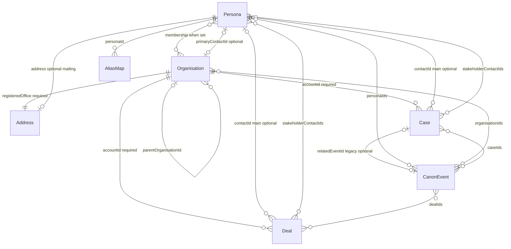
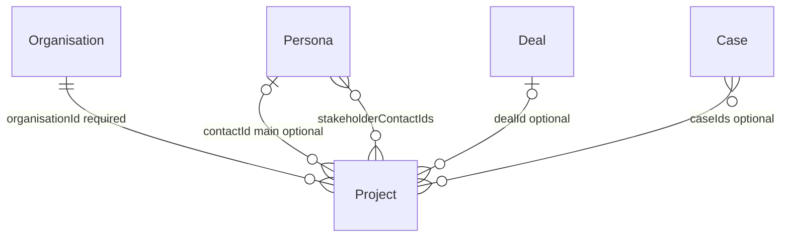
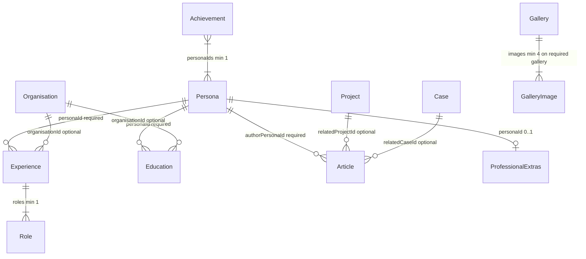
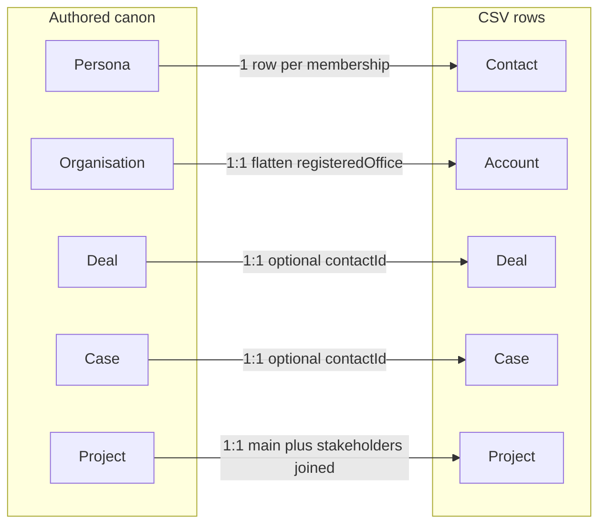

# Entity relationships

**Target CRM-shaped join graph** for Turpinverse canon and export. This page is the intended model for real-world CRM import fidelity while keeping Turpinverse as the source of truth for names and stories.

> **Implementation status:** Shipped JSON, JSON Schema, `CanonValidator`, and CSV export still follow older rules (required deal/case contacts, no stakeholder arrays, single contact row per persona, etc.) until the correction work in the linked GitHub issue lands. Where this page and live code disagree, this page is **target**; code is **current**.

> **Correction issue:** [#41 — Align CRM join schema, export, and canon rows](https://github.com/markheydon/turpinverse/issues/41).

This is a repo artefact (human- and machine-readable Mermaid). It does not change the Blazor app or Hugo site by itself. Field-level validation codes will be assigned when the correction spec is implemented; they are described here in prose until then.

Source of truth for **fields** remains feature data models under `specs/` and `src/Turpinverse.Core/Models/`. This page is the **join graph**.

## Naming

Canon JSON uses universe names. CSV export uses CRM names. They are the same logical records.

| Canon | CRM export | Notes |
|-------|------------|--------|
| Persona | Contact | One persona; **target** export is one CSV row **per account membership** (see Export) |
| Organisation | Account | 1:1 via `organisation.id` → `accountId` |
| Deal | Deal (opportunity analogue) | Authored in `deals.json`; not derived |
| Case | Case | Authored in `cases.json`; not derived |
| Project | Project (optional export) | Shared catalog, not a CRM standard object |

`ProfessionalExtras.contact` is presentation copy on a person page. It is **not** a CRM Contact.

## Core graph (membership, pipeline, timeline)



### What that means

| Link | Target cardinality | Keys | Constraints |
|------|-------------------|------|-------------|
| Persona → Organisation | Many-to-many; contact **must** have ≥1 account | `organisationIds` / `memberPersonaIds` | B2B: no unassigned contacts. Bidirectional when a link exists (VR-003 today). |
| Organisation → Persona | Zero-or-more members | `memberPersonaIds` | Account **may** have zero contacts (prospect / placeholder). |
| Organisation primary contact | Zero-or-one | `primaryContactId` | If set, must be a member. Distinct from contact’s primary account (`organisationIds[0]`). |
| Organisation parent | Zero-or-one parent; zero-or-more children | `parentOrganisationId` | Must reference an existing org when set; no cycles. |
| Deal → Organisation | Exactly one account | `accountId` | Required. |
| Deal → Persona (main) | Zero-or-one | `contactId` | Optional for early pipeline. **When set, must be a member of the deal’s account.** Deceased personas must not own **active** deals (VR-007 today). |
| Deal stakeholders | Zero-or-more | `stakeholderContactIds` | Need **not** be members of the deal’s account (e.g. third-party vendor). |
| Case → Organisation | Exactly one account | `accountId` | Required. |
| Case → Persona (main) | Zero-or-one | `contactId` | Same rules as deal main contact. |
| Case stakeholders | Zero-or-more | `stakeholderContactIds` | Need not be account members. |
| Case → CanonEvent | Zero-or-one (legacy) | `relatedEventId` | Optional; prefer event→case association on the event where both exist. |
| CanonEvent ↔ Persona / Organisation / Deal / Case | Zero-or-more each way | `personaIds`, `organisationIds`, `dealIds`, `caseIds` | Optional arrays; slugs must exist when set. |
| CanonEvent roll-up | Presentation only | — | Linking an event to a case **implies** that case’s account and main contact on Hugo/export timelines; do **not** duplicate those IDs in `events.json`. |
| AliasMap → Persona | Many aliases, one persona | `personaId` | Alias strings globally unique. |
| Address | Nested value object | Org: `registeredOffice`; Persona: `address` | Not shared by id. Per-account email/phone/address **not** in canon — see Export. |

## Commercial objects and projects



### What that means

| Link | Target cardinality | Keys | Constraints |
|------|-------------------|------|-------------|
| Project → Organisation | Exactly one | `organisationId` | Sponsoring account. |
| Project → Persona (main) | Zero-or-one | `contactId` | When set, must be a member of the sponsoring account. |
| Project stakeholders | Zero-or-more | `stakeholderContactIds` | Need not be account members. |
| Project → Deal | Zero-or-one | `dealId` | Project as outcome of won work. |
| Project → Case | Zero-or-more | `caseIds` | Cases as delivery vehicles for project work. |
| Project people (union) | For Hugo/Blazor filters | main ∪ stakeholders | “Projects this person is on” uses all linked contact ids. |

Article `relatedProjectId` / `relatedCaseId` remain **publication** links (“this article is about X”), independent of project→deal/case lineage.

## Career, portfolio, and publication



### What that means

| Link | Target cardinality | Notes |
|------|-------------------|-------|
| Experience → Persona | Exactly one | One grouping per persona per employer key (VR-025 today). |
| Experience → Organisation | Zero-or-one | `organisationId` optional; does not require bidirectional membership. |
| Education → Persona | Exactly one | Owned by one person. |
| Education → Organisation | Zero-or-one | Same optional-org pattern as experience. |
| Achievement ↔ Persona | Many-to-many, min one persona | No organisation FK. |
| Article → Persona | Exactly one author | Author must exist; published mix rules require Turpin Enterprises membership (VR-029 today). |
| Article → Project / Case | Zero-or-one each | Named related links only; reverse lists not required. |
| ProfessionalExtras → Persona | At most one extras row per person | Not CRM Contact. |
| Gallery | Standalone | `subject` is `team` \| `workplace` \| `brand`. No persona or organisation FK. |

Career and publication collections do **not** add CSV columns on contacts, accounts, deals, or cases. See [career-portfolio-mapping.md](./career-portfolio-mapping.md) and [article-gallery-mapping.md](./article-gallery-mapping.md).

## Export projection (target)



| Projection | Target behaviour |
|------------|------------------|
| Contact | **One CSV row per** `(persona, organisation)` membership. Same `contactId` (persona slug) on each row; `accountId` differs. Email/phone/address copied from persona (canon has one identity per person). Document id/email collision policy in the correction spec if a target CRM keys on email. |
| Account | 1:1 from Organisation; optional `primaryContactId` column when implemented. |
| Deal / Case | 1:1; optional `contactId`; optional stakeholder export (second file or joined column — correction spec). |
| Project | 1:1; optional `contactId`, `dealId`, `caseIds`; stakeholders in export. |

Deals and cases are authored in canon; they are not generated from membership edges at export time.

## Intentionally not in canon

| Topic | Decision |
|-------|----------|
| Unassigned contacts | Not allowed — every persona keeps ≥1 `organisationIds` entry (B2B). |
| Per-account contact identity | Not in canon. Duplicate contact rows at export only. |
| Shared Address records | Not modelled; billing vs shipping; geocodes. |
| Gallery / professional-extras → org | Not modelled. |
| Leads, activities, products, quotes | Future CRM/commercial stories (#32 epic); not part of this join correction. |

## Canon rows to fix when schema lands

These rows violate **target** “main contact must be account member” and must be corrected in the correction spec (not required to illustrate optional empty contacts or new stakeholders):

| Record | Issue |
|--------|--------|
| `deal-008` | Henry Clayton × Epping Forest Authority — Henry not a member of that account |
| `case-001` | Dick Turpin × Brazier Legal — Dick not a member of that account |
| `case-017` | Thomas Collier × Turpin Enterprises — Thomas not a member of that account |
| `palmer-identity-vault` | Dick Turpin listed under Brazier Legal project — Dick not a member of that account |

## Where to edit data

```text
src/Turpinverse.Data/canon/
├── personas.json
├── organisations.json
├── events.json
├── aliases.json
├── deals.json
├── cases.json
├── experience.json
├── education.json
├── projects.json
├── achievements.json
├── articles.json
├── galleries.json
└── professional-extras.json
```
